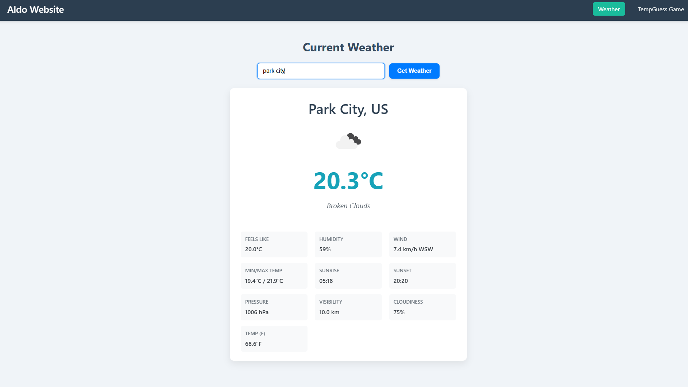

# AppSuite: Weather & TempGuess Game

AppSuite is a dynamic web application that combines a real-time weather information service with an engaging "Guess the Temperature" game. Users can quickly check detailed weather conditions for any city or test their meteorological intuition by guessing a secret city's temperature based on clues.

**Live Demo:** https://aldonvacriates.github.io/Pro-Weather-Game-App/




## Features

### ☀️ Weather App
*   **City Search:** Enter any city name to get its current weather.
*   **Detailed Information:** Displays:
    *   City name and country
    *   Current temperature (in Celsius & Fahrenheit)
    *   "Feels like" temperature
    *   Weather description and icon
    *   Humidity percentage
    *   Wind speed and direction
    *   Min/Max temperatures for the day
    *   Sunrise and sunset times (local to the city)
    *   Atmospheric pressure
    *   Visibility
    *   Cloudiness
*   **Error Handling:** Provides user-friendly messages for invalid city names or API issues.
*   **Responsive Design:** Adapts to various screen sizes for a good user experience on desktop and mobile.

### 🌡️ TempGuess Game
*   **Secret City:** The game randomly selects a city from a predefined list.
*   **Clues Provided:** Users get clues about the secret city:
    *   General weather description (e.g., "scattered clouds")
    *   Weather icon
    *   Humidity
    *   Wind speed
    *   Country
*   **Guess the Temperature:** Players try to guess the current temperature (in Celsius) of the secret city.
*   **Multiple Attempts:** Users have a limited number of attempts (e.g., 5).
*   **Feedback:** Provides hints like "Too high," "Too low," "Very close," "Spot on!"
*   **Reveal Answer:** After the game, the secret city's name and actual temperature are revealed.
*   **Play Again:** Option to start a new game easily.


## Tech Stack

*   **HTML5:** For the structure and content of the application.
*   **CSS3:** For styling, layout (including Flexbox and Grid), and responsiveness.
*   **Vanilla JavaScript (ES6+):** For all dynamic behavior, API interaction, and game logic.
*   **OpenWeatherMap API:** Used to fetch live weather data.

## Setup and Usage

1.  **Clone the repository:**
    ```bash
    git clone git@github.com:Aldonvacriates/Pro-Weather-Game-App.git
    cd your-repository-name
    ```
2.  **Get an API Key:**
    *   Sign up at [OpenWeatherMap](https://openweathermap.org/appid) to get a free API key.
3.  **Configure API Key:**
    *   Open the `index.js` file.
    *   Find the line: `const apiKey = "YOUR_API_KEY_HERE";`
    *   Replace `"YOUR_API_KEY_HERE"` with your actual OpenWeatherMap API key.
    ```javascript
    // Example in index.js
    const apiKey = "52da096ed7ec999aaed4554e8d24fd0f"; // Replace with your key!
    ```
4.  **Open in Browser:**
    *   Simply open the `index.html` file in your web browser.

## File Structure

.<br>
├── index.html # Main HTML structure <br>
├── styles.css # All CSS styles<br>
├── index.js # JavaScript logic for weather app and game<br>
└── README.md # This file<br>

*(You can add a `screenshots/` directory if you have multiple screenshots)*

## How It Works

### Weather App
The weather app takes a city name input by the user. On submission, it makes an asynchronous `fetch` request to the OpenWeatherMap API. The JSON response is then parsed, and the relevant weather data is dynamically inserted into the HTML structure of the "weather card."

### TempGuess Game
The game initializes by randomly selecting a city from a predefined list and fetching its weather data (without revealing the city name or temperature to the user). Clues derived from this data are displayed. The user inputs their temperature guess. JavaScript logic compares the guess to the actual temperature, provides feedback, and manages the game state (attempts, win/loss conditions).

## Future Enhancements 

*   [ ] Add a 5-day forecast feature to the weather app.
*   [ ] Implement a unit toggle (Celsius/Fahrenheit) for user preference.
*   [ ] Allow users to save favorite cities.
*   [ ] Expand the list of cities for the TempGuess game or fetch random cities via a different API.
*   [ ] Add more visual feedback or animations.
*   [ ] Implement local storage to remember user preferences or game state.

## Contributing 

Contributions are welcome! If you have suggestions for improvements or find any bugs, please feel free to open an issue or submit a pull request.

1.  Fork the Project
2.  Create your Feature Branch (`git checkout -b feature/AmazingFeature`)
3.  Commit your Changes (`git commit -m 'Add some AmazingFeature'`)
4.  Push to the Branch (`git push origin feature/AmazingFeature`)
5.  Open a Pull Request

## License 

Distributed under the MIT License. See `LICENSE` file for more information.
*(If you choose to add a license, create a `LICENSE` file in your repo with the MIT License text or another license of your choice.)*

## Acknowledgements

*   [OpenWeatherMap](https://openweathermap.org/) for providing the weather API.
*   [Aldo Herrera](https://github.com/Aldonvacriates) - Project Author

---

**Key Changes from the Previous README:**

*   Removed any direct mention of "custom color palette" or specific color descriptions in the feature list or general description.
*   Added "Responsive Design" as a general feature point for the Weather App, which is a good UI aspect to highlight.
*   Added "Implement local storage..." as a potential future enhancement, which is a common next step for web apps.

This version is more focused on the functionality and technology, making it broadly applicable. Remember to fill in the placeholders as before!